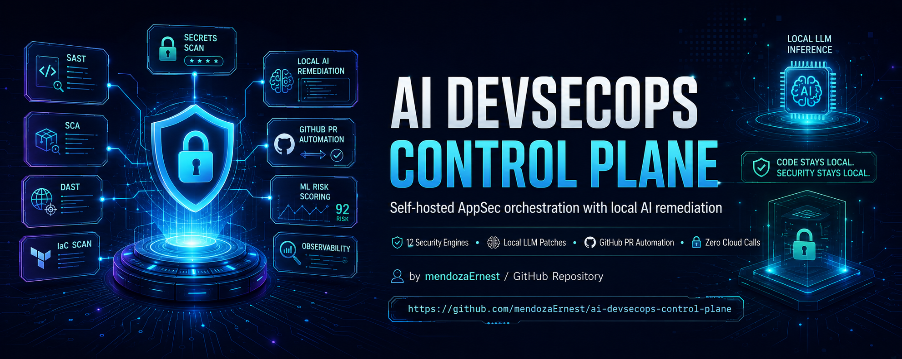

<div align="center">



# 🛡️ AI DevSecOps Control Plane

### Self-hosted application security platform with local AI remediation.

**Your code never leaves your infrastructure.**

[](https://github.com/mendozaErnest/ai-devsecops-control-plane/actions)


-black)


**12 security engines · AI-generated patches on local GPU · real GitHub PRs · zero cloud calls**

[Quick Start](#-quick-start) · [Architecture](#-architecture) · [Security Engines](#-security-engines) · [AI Remediation](#-ai-remediation) · [Agentic DAST](#-agentic-dast) · [Roadmap](#-roadmap)

<!-- TODO: Replace with real dashboard GIF (30s: scan → finding → AI patch → PR opened) -->
<!--  -->

</div>

---

## Why This Exists

Commercial AppSec platforms (Snyk, GitHub Copilot Autofix, SonarCloud) send your source code to external APIs to generate fixes. **In regulated industries — banking, fintech, healthcare, government — that is a regulatory and contractual blocker, not an inconvenience.**

This platform runs the entire security lifecycle, including LLM-powered remediation, on your own hardware. The network boundary is your machine.

| Capability | This platform | Typical cloud AppSec SaaS |
|---|---|---|
| AI-generated code fixes | ✅ Local LLM (Ollama, on-prem GPU) | ✅ Via external API |
| Source code leaves your network | ❌ **Never** | ✅ Required for AI features |
| Works in air-gapped / regulated environments | ✅ By design | ⚠️ Limited or contractually blocked |
| Multi-engine orchestration (SAST · SCA · DAST · IaC · secrets) | ✅ 12 engines, one control plane | Usually per-product silos |
| Inference cost | Your hardware, $0 marginal | Per-seat / per-scan subscription |

## What It Does

```
 Register project → Scan (SAST/SCA/DAST/IaC/Secrets) → Triage with ML risk scoring
        → Generate AI patch (local LLM) → Open reviewable GitHub PR → Track SLA & lifecycle
```

- **12 security engines** orchestrated in parallel — SAST, SCA, DAST, IaC, container CVEs, secret scanning
- **AI remediation via local LLM** (Ollama + `qwen2.5-coder:14b`) — technology-aware prompts for Python, Java, Angular/TypeScript
- **Real GitHub Pull Requests** with patched code via GitHub App (JWT RS256), guarded by AST-level safety checks — nothing merges without human review
- **Agentic DAST**: LangGraph multi-agent loop (Explorer → Attacker → Verifier) wrapping OWASP ZAP
- **ML risk scoring**: XGBoost classifier ranks findings beyond raw severity
- **Enterprise-grade governance**: finding lifecycle state machine, immutable audit trail, per-severity SLA tracking (3/7/30/90 days)

## 🚀 Quick Start

```bash
git clone https://github.com/mendozaErnest/ai-devsecops-control-plane
cd ai-devsecops-control-plane
pip install -r code/requirements.txt
cp .env.example .env          # add GitHub App credentials + Ollama URL

# Local LLM (separate terminal)
ollama pull qwen2.5-coder:14b && ollama serve

# Run
uvicorn src.api.main:app --reload
# Dashboard → http://127.0.0.1:8000
```

Or with Docker Compose (API + Ollama auto-provisioned):

```bash
docker compose up -d
```

### Development — Database Inspection

The SQLite database lives at `dev_database.db` in the project root (always resolved against the project root regardless of uvicorn's launch directory).

Real table names (use these in sqlite3 queries — plural except `scanprofile`):

| Table | Contents |
|---|---|
| `projects` | Registered source-code projects |
| `findings` | Normalized security findings |
| `scans` | Scan executions |
| `remediations` | AI-generated patches and PR links |
| `targets` | Legacy compatibility entity |
| `metrics_snapshots` | Per-target metric snapshots |
| `finding_audit_events` | Audit trail for finding status changes |
| `scanprofile` | Scan profiles (singular — SQLModel default) |

Quick inspection queries:

```bash
# Verify which database file the running server is using
python -c "from src.api.database import DATABASE_URL; print(DATABASE_URL)"

# Last 3 projects
sqlite3 dev_database.db "SELECT name, technology FROM projects ORDER BY rowid DESC LIMIT 3;"

# Last 10 findings (most useful after a DAST run)
sqlite3 dev_database.db "SELECT rule_id, severity, file_path FROM findings ORDER BY rowid DESC LIMIT 10;"
```

Full setup: [docs/api-reference.md](docs/api-reference.md) · GitHub App configuration: [docs/github-app-setup.md](docs/github-app-setup.md) · Threat model: [docs/threat-model.md](docs/threat-model.md)

---

## 🏗 Architecture

```
┌────────────────────────────────────────────────────────────────────────┐
│                          Dashboard (ES6 JS + Chart.js)                 │
│        findings · profiles · diff viewer · risk scores · PDF export    │
└───────────────────────────────┬────────────────────────────────────────┘
                                │ REST
┌───────────────────────────────▼────────────────────────────────────────┐
│                        FastAPI Control Plane                            │
│  ┌──────────────────┐  ┌─────────────────┐  ┌───────────────────────┐  │
│  │ ScanOrchestrator │  │  AI Remediator  │  │  GitHub App Client    │  │
│  │ (ThreadPool,     │  │  (Ollama local, │  │  (JWT RS256, PRs,     │  │
│  │  12 engines,     │  │  AST guardrails)│  │  Check Runs, webhook) │  │
│  │  SHA-256 dedup)  │  └────────┬────────┘  └───────────┬───────────┘  │
│  └────────┬─────────┘           │                       │              │
│  ┌────────▼─────────────────────▼───────────────────────▼───────────┐  │
│  │     SQLModel · Finding lifecycle · Audit trail · SLA · ML model  │  │
│  └──────────────────────────────────────────────────────────────────┘  │
└──────────┬─────────────────────┬───────────────────────┬──────────────┘
           │                     │                       │
   ┌───────▼────────┐   ┌────────▼────────┐   ┌──────────▼──────────┐
   │ SAST/SCA/IaC   │   │  OWASP ZAP +    │   │   Ollama (local     │
   │ Bandit·Semgrep │   │  LangGraph      │   │   GPU inference —   │
   │ Trivy·Checkov… │   │  agent loop     │   │   zero cloud calls) │
   └────────────────┘   └─────────────────┘   └─────────────────────┘
```

<!-- TODO: Add dashboard screenshot here -->
<!--  -->

## 🔍 Security Engines

| Domain | Engines | Coverage |
|---|---|---|
| **SAST** | Bandit, Semgrep (`p/owasp-top-ten`, `p/find-sec-bugs`) | Python · Java · Angular/TypeScript |
| **SCA** | pip-audit (PyPI advisory DB), OWASP Dependency-Check (NVD) | Python · Java CVEs |
| **DAST** | OWASP ZAP (spider + active scan) | Any HTTP/HTTPS target |
| **Agentic DAST** | ZAP + LangGraph multi-agent loop | Confirmed, deduplicated findings |
| **IaC** | Checkov | Dockerfile · Kubernetes YAML · Helm · Terraform |
| **Filesystem CVEs** | Trivy (`trivy fs`, no Docker daemon needed) | Python · Node · Go ecosystems |
| **Secrets** | Gitleaks | Source + optional git history |
| **Quality** | Pylint, ESLint, SonarQube Community REST | Python · Angular · any |

**Scan Profiles** define which engines run per project; the `ScanOrchestrator` executes them in parallel (`ThreadPoolExecutor`) and deduplicates findings by SHA-256 fingerprint. Every engine degrades gracefully when its binary or service is unavailable — a missing tool logs a warning, never crashes a scan.

## 🤖 AI Remediation

Remediations are generated by a **local LLM** with technology-aware prompts, then guarded before they ever touch code:

- **Python** — AST validation enforces syntactically valid patches; only the affected function is replaced. Deterministic findings (weak hashes, duplicate literals) are patched without an LLM call.
- **Java** — secure crypto upgrades, `PreparedStatement` patterns, TLS configuration.
- **Angular/TypeScript** — `DomSanitizer` patterns, CSP guidance; hardcoded secrets are externalized to CI/CD environment variables, never just blanked out.

`is_safe_to_apply()` blocks patches that delete functions, contain placeholder stubs, or remove >20% of source lines. Rejected patches fall back to a **proposal-only PR** — no source code is modified without explicit human approval.

## 🕷 Agentic DAST

A LangGraph `StateGraph` coordinates three agents against a live target, wrapping the ZAP REST API:

| Agent | Role |
|---|---|
| **Explorer** | Spiders the target, maps routes, forms, and auth boundaries; optionally ranks attack surface via LLM |
| **Attacker** | Drives ZAP active scans with focused payloads (XSS, SQLi, path traversal, auth bypass) |
| **Verifier** | Re-requests each alert and confirms exploitability before persisting — cutting false positives |

The loop runs entirely against local services (ZAP + Ollama) and reports live status to the dashboard: `exploring → attacking → verifying → done`.

## 📊 ML Risk Scoring

An XGBoost classifier scores each finding `[0.0–1.0]` from its feature vector (severity, tool, regression count, age, SLA proximity, lifecycle state). The model retrains on demand from the dashboard and falls back to deterministic severity-based scores when untrained — the API never depends on ML availability.

## 🔄 Finding Lifecycle & Governance

```
open ──► fixed ──► regression (re-detected after fix)
  └────► accepted_risk / false_positive (human triage, reason required)
```

Every state transition is recorded in an immutable audit trail. SLA deadlines are assigned per severity (CRITICAL 3d · HIGH 7d · MEDIUM 30d · LOW 90d) and exposed as API filters and dashboard badges. A GitHub Check Run blocks PR merges on critical findings.

## 🔐 Security of the Platform Itself

A security tool must hold itself to its own standard:

- **Path traversal protection** — scan targets are validated against `SCAN_ALLOWED_ROOTS`; arbitrary filesystem access is rejected.
- **No shell injection surface** — subprocess calls avoid `shell=True`; user input is validated before execution.
- **Least-privilege GitHub access** — GitHub App (not PAT) with only `contents:write` + `pull_requests:write`, short-lived installation tokens.
- **Secrets out of code** — all credentials via environment variables; `.env` is git-ignored and self-scanned by Gitleaks.
- **Dogfooding** — the platform scans its own codebase in CI (Bandit + pip-audit + Semgrep on every PR).

Threat model: [docs/threat-model.md](docs/threat-model.md)

## 🧪 Quality & Engineering Discipline

- **117 automated tests** across 15 files (scanners, orchestration, lifecycle, ML fallbacks, GitHub integration)
- CI pipeline runs the platform's own security engines on every pull request
- Graceful degradation is tested behavior, not an accident: ZAP, Ollama, LangGraph, and ML dependencies are all optional at runtime

## 🗺 Roadmap

| Phase | Scope | Status |
|---|---|---|
| 1 | Core platform: multi-language SAST, AI remediation, GitHub PR automation | ✅ |
| 2 | SCA, scan profiles, finding lifecycle, SLA tracking, CI Check Runs | ✅ |
| 3 | Quality engines, semantic patching guardrails, diff viewer | ✅ |
| 4 | DAST + Agentic DAST, infra scanners (Checkov/Trivy/Gitleaks), ML risk scoring, Prometheus/Grafana observability | ✅ |
| 5 | Kubernetes deployment + kube-bench (CIS benchmark), PostgreSQL production profile, SARIF export | 🔜 |

Detailed sprint plan: [ROADMAP.md](ROADMAP.md)

## 🛠 Tech Stack

**Backend:** FastAPI · SQLModel (SQLite, PostgreSQL-ready) · ThreadPoolExecutor orchestration
**AI:** Ollama (`qwen2.5-coder:14b`) · LangGraph · XGBoost
**Security:** Bandit · Semgrep · pip-audit · OWASP Dependency-Check · OWASP ZAP · Checkov · Trivy · Gitleaks
**Integration:** GitHub App (JWT RS256) · GitHub Actions · Prometheus + Grafana
**Frontend:** Modular ES6 JavaScript · Chart.js · i18n (EN/ES)

## 👤 Why I Built This

I spent years doing application security inside a global bank (Santander), where I remediated thousands of critical and high-severity vulnerabilities in production using Fortify, Veracode, and SonarQube. I kept hitting the same wall: the AI tools that could have accelerated remediation were contractually off the table, because they ship source code to external APIs.

So I built the platform I couldn't buy — the full AppSec lifecycle, including AI-generated fixes, running entirely on infrastructure you control. It is both a working security tool and a statement about how AI-assisted security should work in regulated environments.

## 📄 License

MIT — see [LICENSE](LICENSE).

---

<div align="center">
<sub>Built by <a href="https://github.com/mendozaErnest">Ernesto Mendoza</a> — application security engineering for regulated environments.</sub>
</div>
